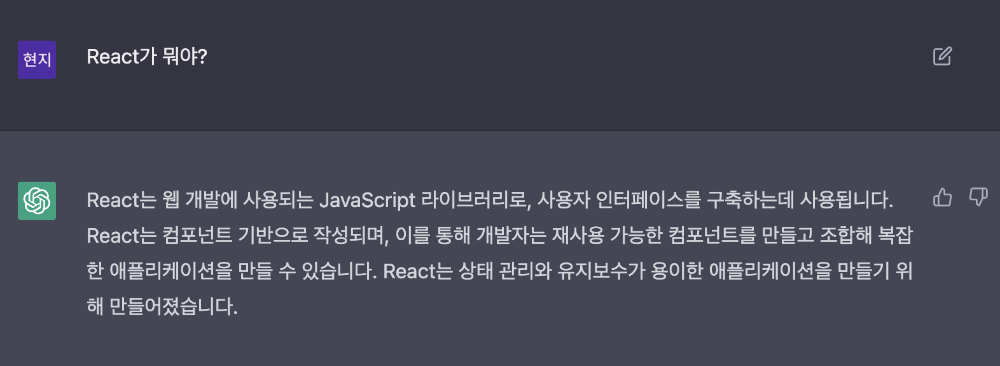
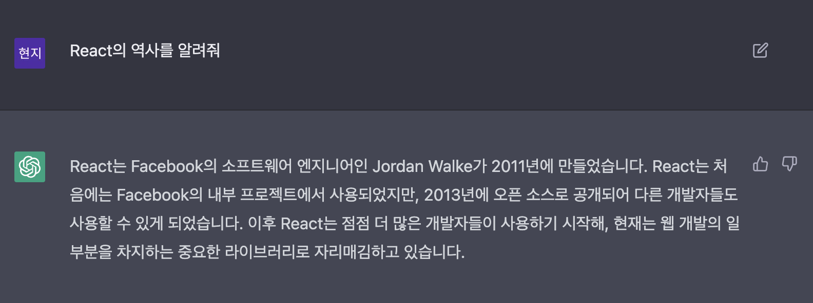

# 1. React 시작하기

# 리액트란?

[https://chat.openai.com/chat](https://chat.openai.com/chat)





[https://react.vlpt.us/basic/01-concept.html](https://react.vlpt.us/basic/01-concept.html)

```jsx
yarn create react-app <프로젝트 이름>
yarn create next-app example
```
