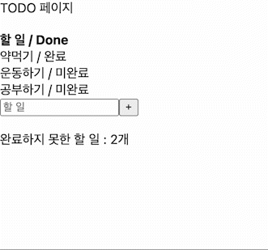
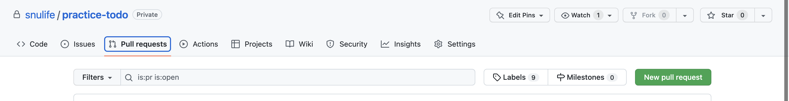

# 2. useEffect, useMemo, useCallback, useRef, useContext

# 과제

## TODO 페이지 만들기!



## 준비

```bash
# 레포 클론하고 브랜치 생성하기
git clone https://github.com/snulife/practice-todo.git
cd practice-todo
git checkout -b 본인영어이름

... 작업 ...

# 작업 사항 commit하고 push하기
git add .
git commit -m {commit message}
git push -u origin
```

- 구현이 완료되면 New pull request로 PR을 날려주세요.



## 스펙

### 1. **Todo 컴포넌트를 작성합니다.**

- todo는 아래 정보를 포함한 object입니다.
  - `id`
  - `할 일`
  - `done 여부`
- Todo 컴포넌트는 todo object를 받아 `{할 일} / {done 여부}` 의 형태로 표시합니다.
  ```jsx
  <Todo todo={todo} />
  ```

### 2. todos state를 생성합니다.

- todos는 todo object의 array입니다.
- 기본으로 아래 todo가 있습니다.
  ```jsx
  id: 1, 할 일: 약먹기, done 여부: 완료
  id: 2, 할 일: 운동하기, done 여부: 미완료
  id: 3, 할 일: 공부하기, done 여부: 미완료
  ```

### 3. map 함수를 이용해 todos를 렌더링합니다.

- map 함수와 1번에서 작성한 Todo 컴포넌트를 이용해 array를 렌더링합니다.

### 4. 할 일을 입력할 수 있는 input을 구현합니다.

- placeholder로 `할 일`이 입력되어 있습니다.
- input 태그에 state를 바인딩합니다.

### 5. 할 일을 추가할 수 있는 + 버튼을 구현합니다.

- - 버튼을 클릭할 경우, todos state의 배열에 input에 들어온 할 일을 추가합니다.
- 추가한 직후 input에 입력된 값을 삭제합니다.
- 추가한 직후 input에 useRef를 이용해 focus합니다.

### 6. 완료하지 못한 할 일 개수를 표시합니다.

- useMemo를 이용해 todos 중 완료하지 못한 할 일의 개수를 계산합니다.

### 참고

- (어려울 때만!) UI 구현이 어렵다면?
  ```jsx
  <div>
    <div>TODO 페이지</div>

    <br />
    <b>할 일 / Done</b>
    {/* TodoList */}

    <input placeholder="할 일" />
    <button>+</button>

    <div>
      <br />
      완료하지 못한 할 일 : 2개
    </div>
  </div>
  ```
  ```jsx
  <div>할 일 / 완료</div>
  ```
