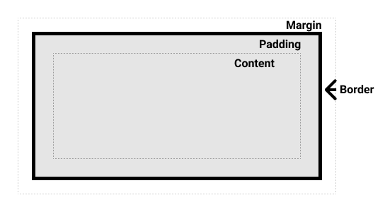
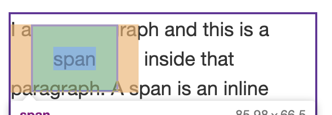
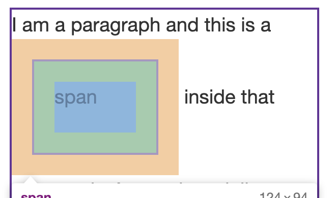
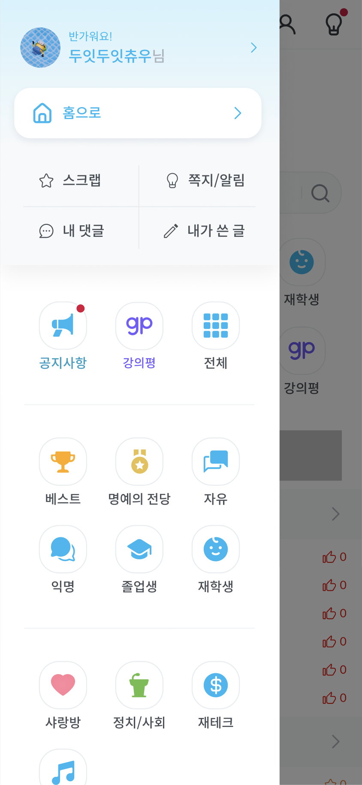
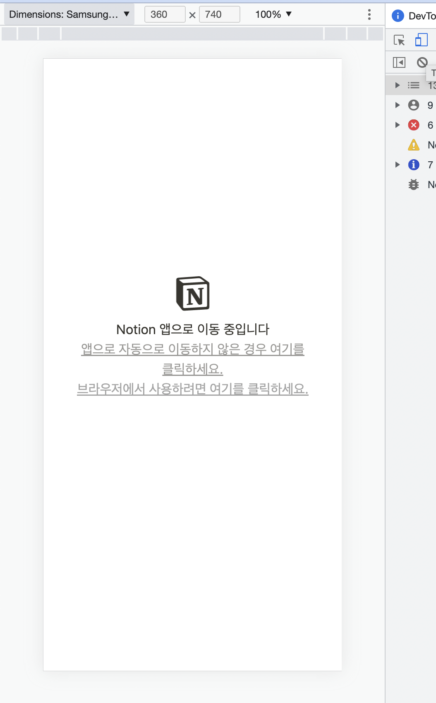
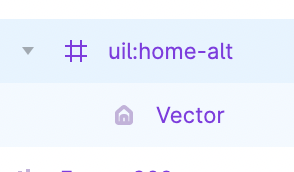

# 3. CSS

1. CSS란?
2. CSS의 ruleset
3. 기본적인 선택자
   1. 요소 선택자 (element selector)
   2. 아이디 선택자 (id selector)
   3. 클래스 선택자 (class selector)
4. 기본적인 속성

   1. color
   2. background-color

5. 텍스트 스타일링

   - 내용

     ```html
     <h1>Tommy the cat</h1>

     <p>I remember as if it were a meal ago...</p>

     <p>
       Said Tommy the Cat as he reeled back to clear whatever foreign matter may
       have nestled its way into his mighty throat. Many a fat alley rat had met
       its demise while staring point blank down the cavernous barrel of this
       awesome prowling machine. Truly a wonder of nature this urban predator —
       Tommy the cat had many a story to tell. But it was a rare occasion such
       as this that he did.
     </p>
     ```

     - font-family
     - font-size (px, em, r(root)em)
     - line-height
     - font-style, font-weight, text-transform, text-decoration, text-shadow
     - text-align
     - letter-spacing, word-spacing
     - white-space, word-break

6. 웹 폰트 적용하기
   1. @rules
   - 내용
     ```css
     @font-face {
       font-family: "myFont";
       src: url("myFont.woff2");
     }
     ```
     `font-family: "myFont", "Bitstream Vera Serif", serif;`
7. 리스트 스타일링

   - 내용

     ```html
     <h2>Shopping (unordered) list</h2>

     <p>
       Paragraph for reference, paragraph for reference, paragraph for
       reference, paragraph for reference, paragraph for reference, paragraph
       for reference.
     </p>

     <ul>
       <li>Hummus</li>
       <li>Pita</li>
       <li>Green salad</li>
       <li>Halloumi</li>
     </ul>

     <h2>Recipe (ordered) list</h2>

     <p>
       Paragraph for reference, paragraph for reference, paragraph for
       reference, paragraph for reference, paragraph for reference, paragraph
       for reference.
     </p>

     <ol>
       <li>Toast pita, leave to cool, then slice down the edge.</li>
       <li>
         Fry the halloumi in a shallow, non-stick pan, until browned on both
         sides.
       </li>
       <li>Wash and chop the salad.</li>
       <li>Fill pita with salad, hummus, and fried halloumi.</li>
     </ol>

     <h2>Ingredient description list</h2>

     <p>
       Paragraph for reference, paragraph for reference, paragraph for
       reference, paragraph for reference, paragraph for reference, paragraph
       for reference.
     </p>

     <dl>
       <dt>Hummus</dt>
       <dd>
         A thick dip/sauce generally made from chick peas blended with tahini,
         lemon juice, salt, garlic, and other ingredients.
       </dd>
       <dt>Pita</dt>
       <dd>A soft, slightly leavened flatbread.</dd>
       <dt>Halloumi</dt>
       <dd>
         A semi-hard, unripened, brined cheese with a higher-than-usual melting
         point, usually made from goat/sheep milk.
       </dd>
       <dt>Green salad</dt>
       <dd>
         That green healthy stuff that many of us just use to garnish kebabs.
       </dd>
     </dl>
     ```

     - list-style-type
     - list-style-position
     - list-style-image
     - start, reversed, value

8. 링크 스타일링

   1. pseudo-class 선택자

   - 내용
     ```html
     <p><a href="#">A simple link</a></p>
     ```
     - link, visited, focus, hover, active

9. 박스 스타일링
   - 내용
     
     - box-sizing
     - padding, margin
     - block
       - div, p
       - 박스는 인라인 방향으로 연장되어 상위 콘테이너에서 사용 가능한 공간을 채웁니다. 대부분은 경우 이것은 박스가 사용 가능한 공간을 100%로 채우면서 상위 콘테이너 너비만큼 된다는 의미입니다.
       - 박스는 새 줄로 행갈이를 합니다.
       - `[width](https://developer.mozilla.org/ko/docs/Web/CSS/width)`와 `[height](https://developer.mozilla.org/ko/docs/Web/CSS/height)` 속성은 존중됩니다.
       - 패딩과 여백, 테두리로 인해 다른 요소들이 박스로부터 밀려납니다.
     - inline
       - span, a
       - 박스는 새 줄로 행갈이를 하지 않습니다.
       - `[width](https://developer.mozilla.org/ko/docs/Web/CSS/width)`와 `[height](https://developer.mozilla.org/ko/docs/Web/CSS/height)` 속성은 적용되지 않습니다.
       - 패딩과 여백, 테두리는 다른 인라인 박스들이 당 박스로부터 멀어지지게 하지 않습니다.
         
     - inline-block
       
     - background
       - background-color
       - background-image
         - `linear-gradient(105deg, rgba(0,249,255,1) 39%, rgba(51,56,57,1) 96%)`
         - url()
       - background-repeat
       - background-position
       - background-size
     - border
       - border-width
       - border-style
       - border-color
     - overflow
10. 크기 조정 방법
    - width, height
      - %
      - viewport
    - max-
11. 레이아웃

    - flex
      [이번에야말로 CSS Flex를 익혀보자](https://studiomeal.com/archives/197)
    - grid
      [이번에야말로 CSS Grid를 익혀보자](https://studiomeal.com/archives/533)
    - position

12. 결합자
    1. `+`
    2. `>`
    3. ``
    4. `~`
    5. `,`
13. 속성 선택자
    1. `[type=”submit”]`
14. pseudo-class
    1. first-child, nth-child, last-child
15. pseudo-element
    1. ::after, ::before
    2. ::placeholder

# 과제

> **스누라이프 사이드바 만들기!**

### 디자인 시안

[https://www.figma.com/file/wu3rhPOSP6p5vX7c5neUdE/%F0%9F%91%8B-Community-(PC%2FMobile)?node-id=1029%3A98885&t=5Hk9VxxOYTIc0W8c-0](<https://www.figma.com/file/wu3rhPOSP6p5vX7c5neUdE/%F0%9F%91%8B-Community-(PC%2FMobile)?node-id=1029%3A98885&t=5Hk9VxxOYTIc0W8c-0>)



### 개발 방법

1. 터미널을 켜서 루트로 갑니다.
2. 아래 명령어를 입력합니다.

```bash
# 레포 클론하고 브랜치 생성하기
git clone https://github.com/snulife/practice-css.git
cd practice-css
git branch -b 본인영어이름
```

1. practice-css 폴더를 열어서 index.html, index.css에 작업합니다.
2. 아래 명령어를 입력합니다.

```bash
# 작업 사항 commit하고 push하기
git add .
git commit -m {commit message}
git push -u origin
```

1. 작업이 끝났으면 PR을 날려주세요.

### 확인 방법

1. 터미널에서 practice-css로 진입한 후, `code .` 명령어로 vscode를 엽니다.
2. index.html에서 우클릭 → Open with Live Server



1. 크롬에서 개발자도구(F12)를 엽니다.
2. 오른쪽 상단에 보이는 휴대폰 모양 버튼을 클릭하면 모바일 기기로 볼 수 있습니다.
3. Samsung S8 어쩌구로 했을 때 예쁘게 나오도록 개발해주세요.

### 스펙

- 뒷 배경에는 아무 요소도 없어도 괜찮습니다.
- Dimmer(회색 배경)가 화면 전체를 덮고 있어야 합니다.
- Sidebar가 Dimmer 위에 존재해야 합니다.
- 아이콘은 svg로 추출해서 icons 폴더에 위치한 후 img 태그를 이용합니다.
  - 추출할 때는 Vector를 선택하지 말고 프레임(# 모양)을 선택해서 추출한 후, 프레임 크기대로 사용하시면 됩니다.
    
- 게시판 버튼들은 flex-wrap 속성을 이용해야 합니다.
- 정렬이 필요할 때는 무조건 flex를 사용해서 개발해주세요.
